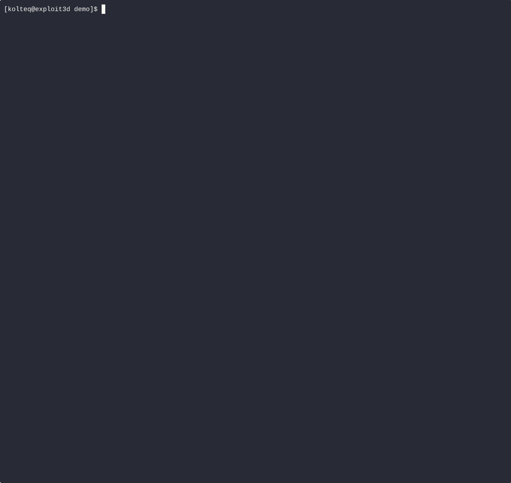

# Nodes/Proxy GET RCE Fix
Mitigates the [Kubernetes Nodes/Proxy GET RCE](https://grahamhelton.com/blog/nodes-proxy-rce) by enforcing an Istio sidecar outbound filter that blocks WebSocket upgrades to the kubelet (port 10250).



## What this chart deploys
- `ServiceEntry` + `DestinationRule` in the Istio config namespace for a static `kubelet.internal` service mapping to node IPs.
- `EnvoyFilter` objects in target namespaces that:
  - inspect TLS on outbound port 10250,
  - terminate TLS in the sidecar,
  - block WebSocket `Upgrade` requests with a 403 response,
  - forward other traffic to `kubelet.internal` over HTTPS.

## Prerequisites
- Kubernetes cluster with Istio installed (CRDs for `EnvoyFilter`, `ServiceEntry`, `DestinationRule`).
- Sidecar injection enabled for the workloads you want to protect.
- Node (kubelet) internal IPs available (`kubectl get nodes -o wide`).

## Configuration
Review defaults:

```bash
helm show values oci://registry.kolteq.com/nodes-proxy-get-rce-fix/nodes-proxy-get-rce-fix --version 0.1.0
```

Minimal values example:

```yaml
configNamespace: istio-system
kubeletIps:
  - 10.142.0.4
  - 10.142.0.5
enforcements:
  - namespace: app-ns
    workloads:
      - name: block-nginx
        labels:
          app: nginx
```

Key values:
- `configNamespace`: Namespace for Istio config (`ServiceEntry`, `DestinationRule`), typically `istio-system`.
- `kubeletIps`: List of kubelet node IPs (one entry per node).
- `enforcements`: List of namespaces and workload selectors to apply the `EnvoyFilter` to.

## Install

Install the Helm chart.

```bash
helm install kolteq-nodes-proxy-get-rce-fix oci://registry.kolteq.com/nodes-proxy-get-rce-fix/nodes-proxy-get-rce-fix --version 0.1.0 -f values.yaml
```
